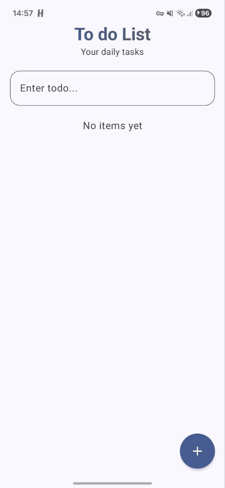
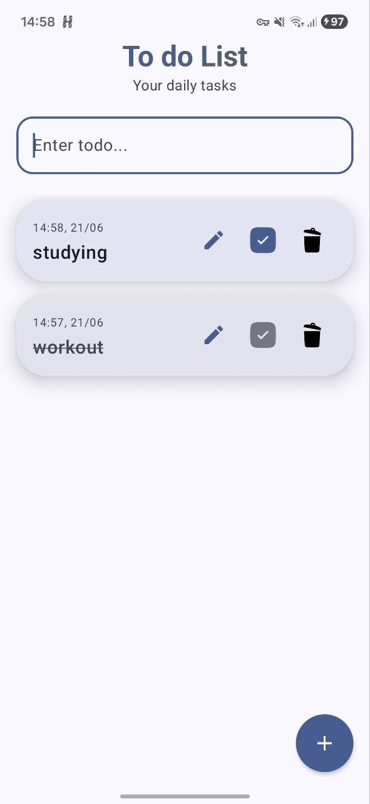
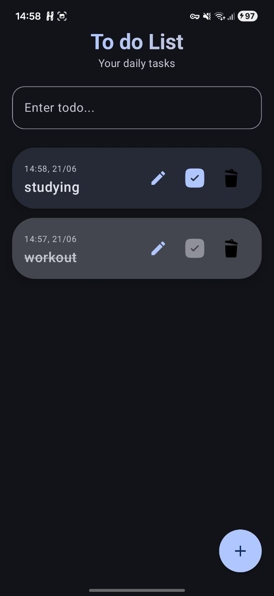

# ToDo List App 
##  Features
- **Create Tasks:** Easily add new tasks.
- **Delete Tasks:** Remove completed and edit tasks.
- **Persistent Storage:** Your data is saved locally and remains available even after closing the app.
- **Modern UI:** Built with a simple and minimal UI.

##  Tech Stack & Architecture
This app follows the **official Android architectural guidance** to ensure scalability and maintainability.

- **Language:** [Kotlin](https://kotlinlang.org/)
- **UI Framework:** [Jetpack Compose](https://developer.android.com/jetpack/compose) (Declarative UI)
- **Architecture:** **MVVM** (Model-View-ViewModel) - Separation of concerns for a clean codebase.
- **Local Database:** **Room Persistence Library** (Abstraction layer over SQLite).
- **Asynchronous Programming:** Kotlin Coroutines for non-blocking database operations.

##  Screenshots
<div align="center">
  
  
  
</div>

<!-- 
<p align="center">
  
</p> 
-->

##  How to Run
1. Clone the repository:
```bash
   git clone https://github.com/ArMiiNaa/todo-list-app.git
